# Open SMS Gateway

[](https://github.com/mathisokle/open-sms-gateway/actions/workflows/ci.yml)
[](LICENSE)
[](pyproject.toml)
[](gateway/api/main.py)
[](docs/SPEC.md#6-database)
[](docker-compose.yml)
[](docs/hardware.md#any-linux-host-will-do)
[](docs/hardware.md)
[](CONTRIBUTING.md#the-fake-modem)
[](pyproject.toml)
[](CONTRIBUTING.md)

Plug a 4G USB dongle into **any Linux machine** and get a **self-hosted SMS API**. Send and
receive text messages over HTTP with bearer tokens, have inbound messages pushed to your own
endpoint as signed webhooks, and run the whole thing from an admin panel that works offline.

No SMS provider account, no per-message fees, no third party reading your messages — just your
SIM, your hardware, your database.

A Raspberry Pi is the reference build because it is the most constrained target, but nothing here
is Pi-specific: a mini PC, a NAS, an old laptop, a thin client or an x86 server with a free USB
port all work the same way. See [Any Linux host will do](docs/hardware.md#any-linux-host-will-do).

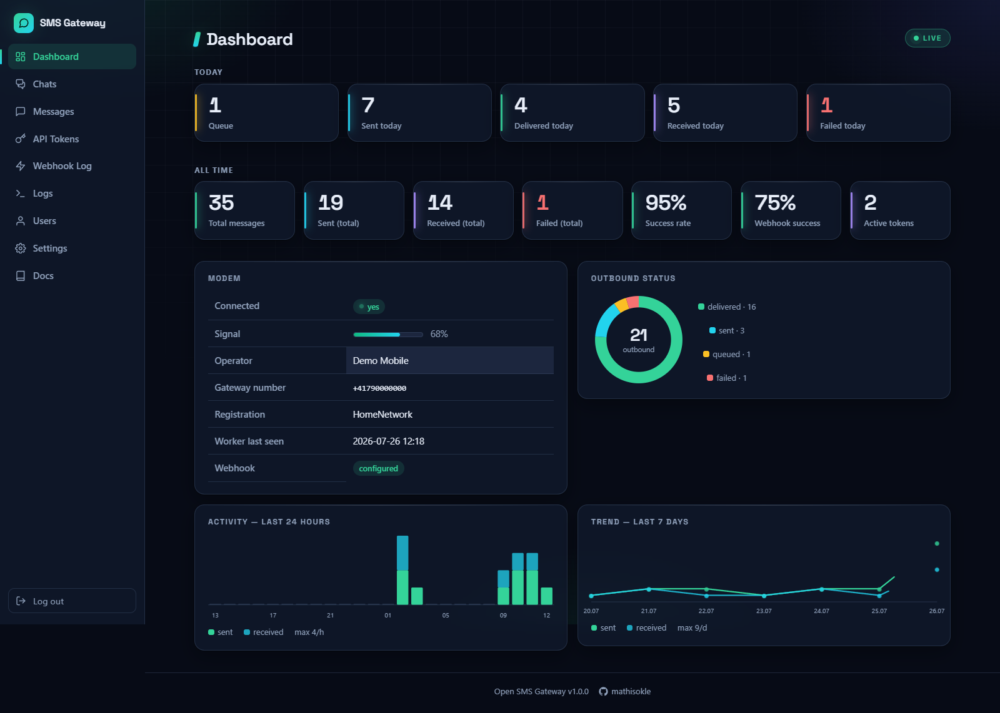

## Contents

- [Why this exists](#why-this-exists)
- [Features](#features)
- [Screenshots](#screenshots)
- [The hardware](#the-hardware)
- [How it works](#how-it-works)
- [Quick start without hardware](#quick-start-without-hardware)
- [Install on a Linux host](#install-on-a-linux-host)
- [Using the API](#using-the-api)
- [Receiving messages](#receiving-messages)
- [Documentation](#documentation)
- [Operating notes](#operating-notes)
- [Contributing](#contributing)

## Why this exists

Commercial SMS APIs are excellent — until you want a phone number that is *yours*, messages that
never leave your network, or a bill that does not scale with volume. Typical fits:

- **Alerting that survives the internet.** Monitoring, home automation and backup jobs can text
  you even when your uplink is the thing that broke.
- **Two-way workflows on a real number.** People reply to a normal mobile number; replies land in
  your application through a webhook.
- **Data you keep.** Message bodies live in one SQLite file on your own disk.
- **A number tied to your SIM.** Useful where a shortcode or a rented number is not accepted.

It is deliberately **single-tenant**: one SIM, one number, one operator. That assumption is what
keeps the codebase small enough to read in an afternoon.

**What it is not:** a bulk-messaging platform. A consumer SIM sends a handful of messages per
minute, and mobile operators disconnect SIMs used for mass messaging. See
[Operating notes](#operating-notes).

## Features

| | |
|---|---|
| **REST API v1** | Send SMS, list and filter messages, cursor pagination, `/healthz`. Full [reference](docs/manual/rest-api.md). |
| **Bearer tokens** | Stored as SHA-256 hashes only, several in parallel, individually revocable, shown in plaintext exactly once. |
| **Signed webhooks** | Inbound SMS pushed as JSON with an `X-Gateway-Signature` HMAC-SHA256 header, retry backoff 1m/5m/30m/2h/6h, manual retry. |
| **Admin panel** | Dashboard, conversation view with reply box, message browser, token and webhook management, event log, backups. |
| **Built-in manual** | The complete operator manual renders inside the panel under **Docs** — no internet needed. |
| **Long messages** | Automatic GSM-7 / UCS-2 detection and multipart concatenation, with a live segment counter in the composer. |
| **Delivery reports** | `delivered` status when the modem and network provide status reports — [best effort](docs/manual/troubleshooting.md#why-messages-never-reach-delivered). |
| **Send throttle** | Segment-based token bucket, conservative by default, to stay inside what a consumer SIM tolerates. |
| **Resilient** | Reconnects forever if the dongle drops, queue survives power loss, structured JSON logs, `restart: unless-stopped`. |
| **Light** | Two containers, one SQLite file, ~300 MB RAM total. No broker, no Node build, no external CDN. |

## Screenshots

The panel is server-rendered (Jinja2 + htmx), ships its own font, and follows your system's
light or dark preference.

| Conversations | Message browser |
|---|---|
| [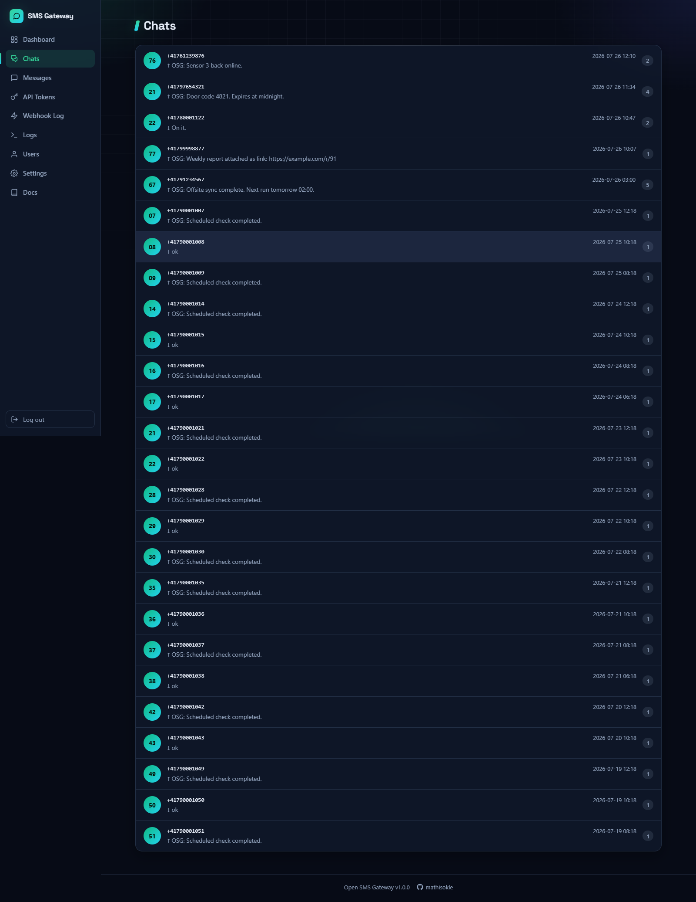](docs/screenshots/chats.png) | [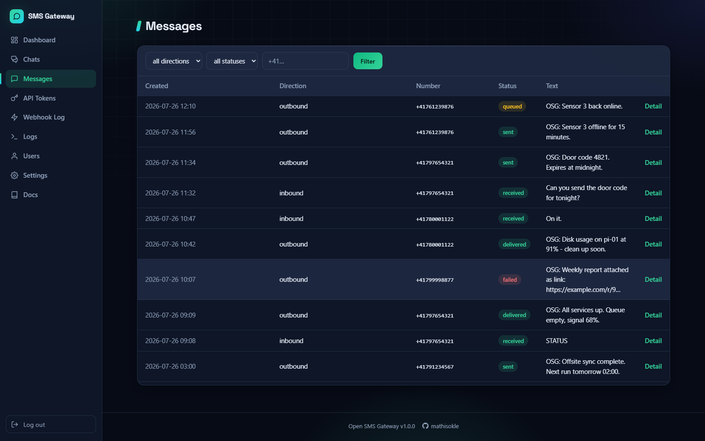](docs/screenshots/messages.png) |
| Threads per number, with a reply box. | Filter by direction, status and number. |

| Chat view | API tokens |
|---|---|
| [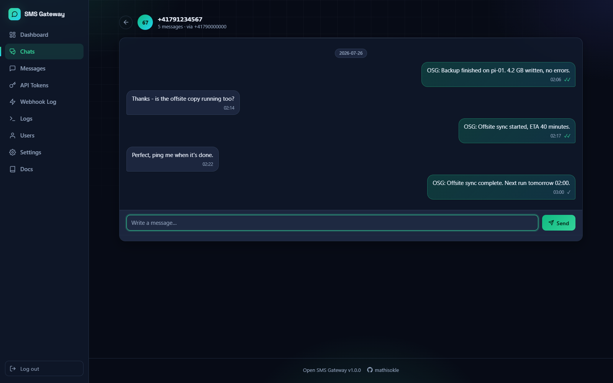](docs/screenshots/chat.png) | [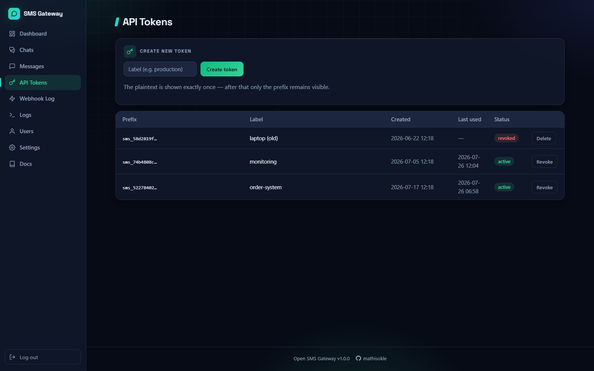](docs/screenshots/tokens.png) |
| ✓ sent, ✓✓ delivered. | Plaintext shown once, then prefix only. |

| Webhook log | Event log |
|---|---|
| [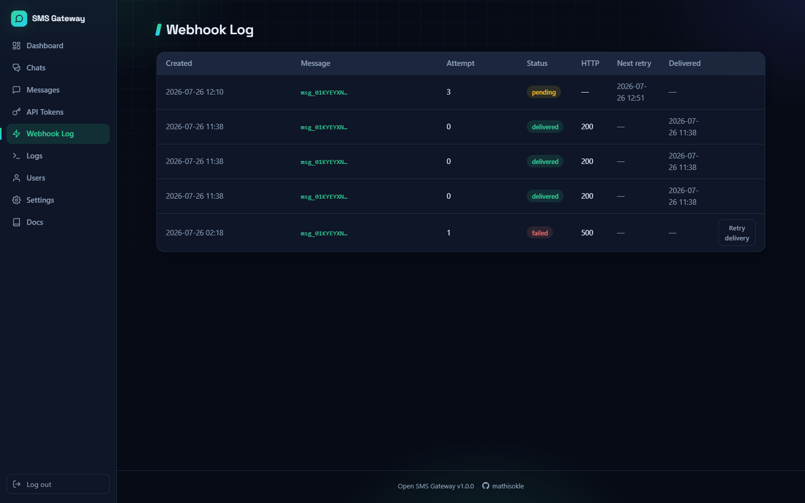](docs/screenshots/webhook-log.png) | [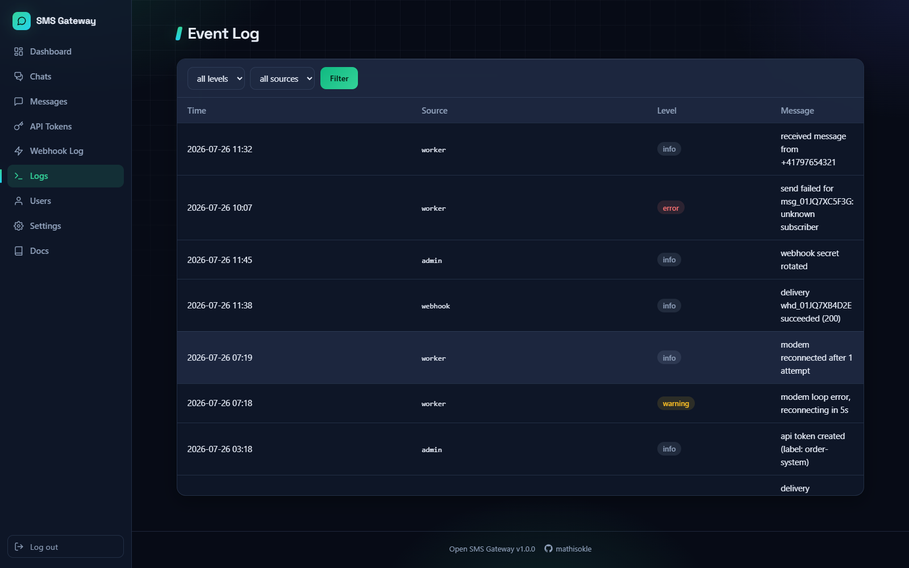](docs/screenshots/logs.png) |
| Every attempt, response code, manual retry. | Worker, webhook and admin events. |

| Settings | Built-in manual |
|---|---|
| [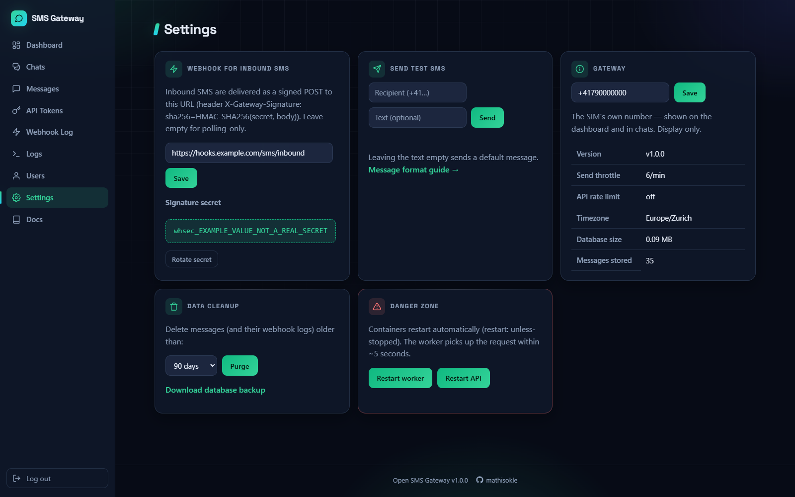](docs/screenshots/settings.png) | [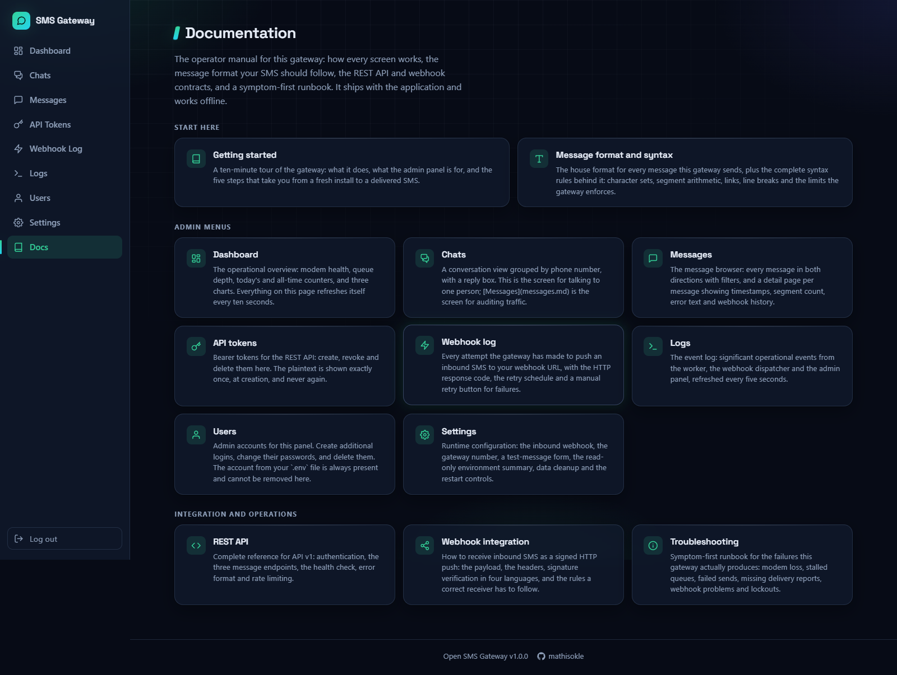](docs/screenshots/docs.png) |
| Webhook target, test SMS, cleanup, backup. | The operator manual, offline. |

<details>
<summary>Light mode, login screen and a manual page</summary>

| | |
|---|---|
| [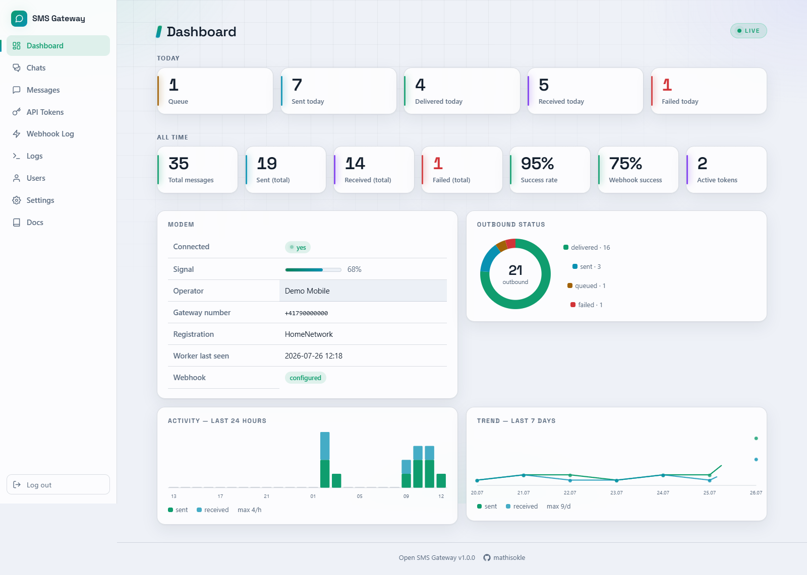](docs/screenshots/dashboard-light.png) | [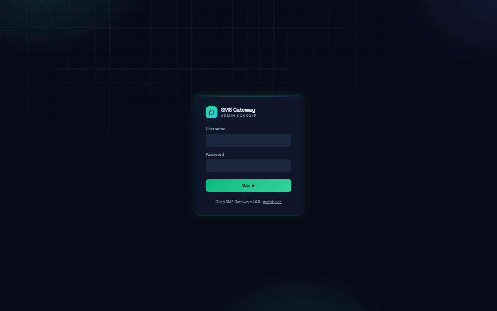](docs/screenshots/login.png) |
| Light mode follows `prefers-color-scheme`. | Login, throttled to 10 attempts per minute. |

[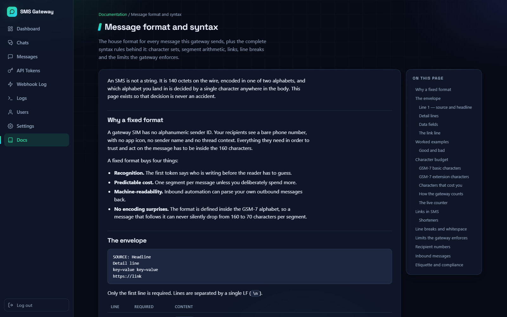](docs/screenshots/docs-page.png)

</details>

> Screenshots show demo data from the fake modem driver. Phone numbers, messages and the webhook
> secret in them are fictional.

## The hardware


That is the whole machine: a **SIM7600E-H 4G USB dongle** and a host to plug it into — here a
Raspberry Pi 3 in an open case, with the dongle velcro-strapped on top and the antenna screwed in.

Two details in that photo matter more than the rest:

- **The antenna is attached.** Signal quality dominates everything you can configure in software.
- **The dongle sits on its own USB cable**, not jammed straight into the board. It draws current
  spikes while transmitting; a decent supply and cable are what keep it from resetting mid-send.

The dongle presents *five* serial devices to the host, and only interface 02 is the AT command
port the gateway talks to. Getting that right is the single most common setup mistake — see
[hardware.md](docs/hardware.md#the-serial-port-that-matters).

**You do not need a Raspberry Pi.** Any Linux machine with a free USB port runs this: a mini PC, a
NAS, a router with USB, an old laptop, an x86 server, or a VM with the dongle passed through. The
Pi is simply the smallest thing that works, so it is what the resource budget is written against.

## How it works

Two containers from one image, sharing a SQLite database on a Docker volume:

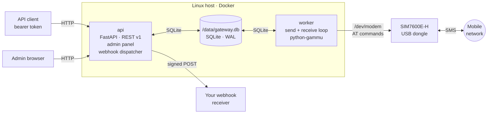

The queue is a database table, not a broker. Sending is deliberately throttled to a few segments a
minute (`MESSAGES_PER_MINUTE`, default 6 — roughly one single-segment message every ten seconds),
because that is what a consumer SIM and its operator tolerate, **not** because the modem cannot go
faster. At that rate polling a table is simpler and more robust than any messaging middleware, and
the queue survives power loss for free. Only the worker touches the modem — exactly one process on
the serial port. Full reasoning in [Architecture](docs/ARCHITECTURE.md).

The gateway serves **plain HTTP**. Run it on a trusted LAN, or put TLS in front of it before it
leaves your network — see [Security](docs/security.md#if-it-must-be-reachable-terminate-tls).

## Quick start without hardware

The entire test suite and the whole admin panel run against a fake modem driver, so you can try
everything on a laptop first.

```bash
git clone https://github.com/mathisokle/open-sms-gateway.git
cd open-sms-gateway
python -m venv .venv && . .venv/bin/activate      # Windows: .venv\Scripts\activate
pip install -r requirements.txt -r requirements-dev.txt

pytest                                             # 267 tests, no hardware needed
```

Run it locally:

```bash
export MODEM_FAKE=1 ADMIN_USER=admin ADMIN_PASSWORD=local-dev-password \
       SECRET_KEY=at-least-32-characters-of-local-dev-secret DATABASE_PATH=./dev.db

uvicorn gateway.api.main:app --reload --port 8080   # API + admin panel
python -m gateway.worker.main                       # worker, in a second terminal
```

**Run that same `export` line in the second terminal too.** The worker reads the identical
variables and refuses to start without them (`invalid configuration: ADMIN_PASSWORD is not set`),
and without `DATABASE_PATH` it would open a different database from the API.

Open <http://127.0.0.1:8080/admin>. With `MODEM_FAKE=1` the worker writes "sent" messages to
`fake_sent.jsonl` and reads simulated inbound messages from `fake_inbound.jsonl`, both next to
your database — see [Development](CONTRIBUTING.md#the-fake-modem).

## Install on a Linux host

You need a Linux machine with a free USB port (arm64 or x86-64), Docker, a SIM7600E-H USB dongle,
and a SIM with its **PIN disabled**. Hardware details:
[docs/hardware.md](docs/hardware.md).

```bash
# 1. Docker, once
curl -fsSL https://get.docker.com | sh
sudo usermod -aG docker "$USER"
newgrp docker                     # or log out and back in

# 2. ModemManager must not claim the serial port
sudo systemctl disable --now ModemManager

# 3. Get the code and configure
git clone https://github.com/mathisokle/open-sms-gateway.git
cd open-sms-gateway
cp .env.example .env

# 4. Find the dongle's AT port — the "if02" entry, not ttyUSB0
ls -l /dev/serial/by-id/

# 5. In .env set HOST_MODEM_DEVICE to that by-id path, MODEM_FAKE=0,
#    plus ADMIN_PASSWORD (12+ chars) and SECRET_KEY (32+ chars)
nano .env

# 6. Build and start
docker compose up -d --build
```

The image builds for whatever architecture you are on — no cross-compilation and no separate arm
build. On a Pi 3 the first build takes several minutes; on an x86 mini PC it is under a minute.

Then open `http://<gateway>:8080/admin`, create an API token, and optionally point the webhook at
your endpoint. The step-by-step version with a checkpoint after every step is
[docs/installation.md](docs/installation.md).

## Using the API

Send a message:

```bash
curl -X POST http://<gateway>:8080/api/v1/messages \
  -H "Authorization: Bearer sms_..." \
  -H "Content-Type: application/json" \
  -d '{"to": "+41791234567", "body": "Backup finished, no errors."}'
```

```json
{"id": "msg_01J8ZQ...", "status": "queued", "segments": 1, "created_at": "2026-01-15T18:00:00Z"}
```

The call returns as soon as the message is queued; the worker sends it within seconds and the
status moves `queued → sending → sent` (then `delivered`, if reports are available). Poll for
inbound messages:

```bash
curl -H "Authorization: Bearer sms_..." \
  "http://<gateway>:8080/api/v1/messages?direction=inbound&since=2026-01-15T18:00:00Z"
```

Complete endpoint reference, filters, cursor pagination and error codes:
[REST API](docs/manual/rest-api.md).

## Receiving messages

Either poll the endpoint above, or let the gateway push to you. Every inbound SMS is POSTed as
JSON with an HMAC-SHA256 signature over the raw body:

```
X-Gateway-Signature: sha256=<hex>
X-Gateway-Delivery: whd_01J8ZQ...        # stable across retries — use it as an idempotency key
```

```python
import hashlib
import hmac


def verify(raw_body: bytes, header: str, secret: str) -> bool:
    expected = "sha256=" + hmac.new(secret.encode(), raw_body, hashlib.sha256).hexdigest()
    return hmac.compare_digest(expected, header)
```

Always compute the signature over the **raw** body, before any JSON parsing. Non-2xx responses
are retried after 1m, 5m, 30m, 2h and 6h, then marked failed and retriable by hand from the
panel. Receiver requirements and worked examples:
[Webhook integration](docs/manual/webhooks.md).

## Documentation

**Operator manual** — written for the admin panel, also readable here. It renders under
`/admin/docs` on your own gateway, offline:

| Page | Contents |
|---|---|
| [Getting started](docs/manual/getting-started.md) | What the gateway is, and five steps to the first SMS |
| [Message format](docs/manual/sms-format.md) | GSM-7 vs UCS-2, segments, links, character budgets |
| [REST API](docs/manual/rest-api.md) | Endpoints, parameters, errors, paging |
| [Webhook integration](docs/manual/webhooks.md) | Payload, signature verification, receiver rules |
| [Troubleshooting](docs/manual/troubleshooting.md) | Symptom-first runbook |
| [All pages](docs/manual/README.md) | One page per admin menu, plus the above |

**Running and understanding it** — see [docs/README.md](docs/README.md) for the full index:

| Guide | Contents |
|---|---|
| [Hardware](docs/hardware.md) | Dongle, SIM, power, antennas, what to buy and what to avoid |
| [Installation](docs/installation.md) | Host setup end to end, with a checkpoint after every step |
| [Configuration](docs/configuration.md) | Every environment variable and runtime setting |
| [Operations](docs/operations.md) | Backup, restore, updates, monitoring, log reading |
| [Security](docs/security.md) | Threat model, exposure options, what is protected and what is not |
| [Architecture](docs/ARCHITECTURE.md) | How it is built and why |
| [Specification](docs/SPEC.md) | Behavioural source of truth |
| [Module map](docs/CODE-MAP.md) | Where each part lives and which tests cover it |

## Operating notes

- **Respect your operator.** A consumer SIM is not a bulk channel. Keep `MESSAGES_PER_MINUTE`
  conservative, and read your contract — operators filter and disconnect SIMs used for mass
  messaging. Sending unsolicited messages is illegal in most jurisdictions.
- **Keep it off the open internet.** Run it on a trusted LAN. If you must expose it, terminate
  TLS with the commented-out Caddy service in `docker-compose.yml` or use a VPN, and set
  `SESSION_COOKIE_SECURE=1`. See [Security](docs/security.md).
- **Power matters.** The dongle draws current spikes while transmitting; an undersized supply
  shows up as a modem that resets under load.
- **Delivery reports are not guaranteed.** Many SIMs and modem firmwares never produce them, so
  `delivered` stays best effort and messages stop at `sent`.
- **Backups are one file.** The whole state is `/data/gateway.db`; there is a download button in
  Settings. See [Operations](docs/operations.md#backup-and-restore).

## Contributing

Tests run without hardware, so contributions do not need a dongle. See
[CONTRIBUTING.md](CONTRIBUTING.md) for setup, ground rules and the pull-request checklist, and
[SECURITY.md](SECURITY.md) for reporting vulnerabilities.

## License

[MIT](LICENSE) © Mathis Okle
