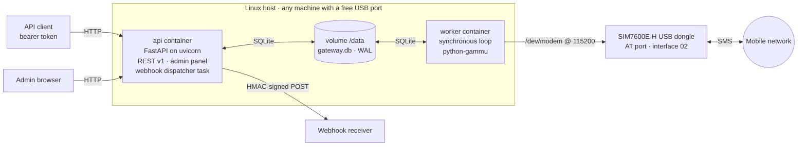
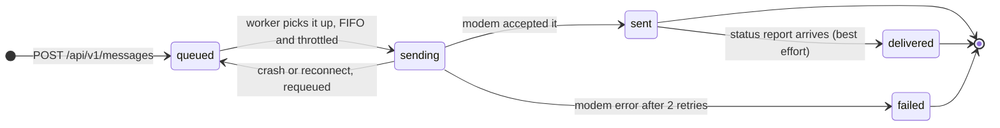
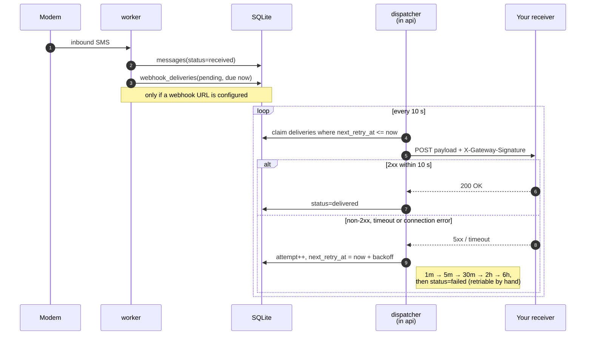

# Architecture

How the gateway is built and why it is built that way. [SPEC.md](SPEC.md) defines the behaviour;
this document explains the machinery behind it. Section numbers are referenced from code comments
(`ARCHITECTURE §2`, …) and are stable.

## 1. Shape of the system

Two containers built from **one** image — same build, different command — sharing a SQLite database
on a Docker volume:



**api** — FastAPI on uvicorn, serving REST API v1, the admin panel (Jinja2 + htmx), and the webhook
dispatcher as an asyncio background task in the same process.

**worker** — a plain synchronous Python process running one loop: drain the outbox, read the modem
inbox, write status and heartbeat. **Only the worker touches the modem**, so exactly one process
ever holds the serial port.

**No broker.** The queue is the `messages` table with `status='queued'`. At the throughput of a
single modem — roughly one message every ten seconds — polling a table is simpler, easier to reason
about, and more robust than any messaging middleware. It also means the queue survives power loss
for free.

Why the process split at all: `python-gammu` is blocking. Running it inside the event loop would
stall API requests for the duration of every modem operation. Splitting it out means the worker can
be written as straightforward synchronous code while the API stays responsive — and it makes "one
process on the serial port" an architectural guarantee rather than a convention.

## 2. The worker loop

The driver abstraction (`gateway/worker/modem.py`) is what keeps hardware out of the tests:

```python
class ModemDriver(Protocol):
    def connect(self) -> None: ...
    def send_sms(self, to: str, body: str) -> SendResult: ...   # segments + TP-MR
    def fetch_inbound(self) -> list[InboundEvent]: ...          # reads, deletes, reassembles
    def status(self) -> ModemStatus: ...                        # signal, operator, registration

# InboundEvent = InboundSMS | DeliveryReport — one poll returns both, mixed.
#
# Errors carry the recovery strategy:
#   ModemError            the message is retryable
#   ModemConnectionError  reconnect, then requeue what was in flight
#   PartialSendError      a multipart send got partly out — never resend, it would duplicate

class GammuDriver:   # real hardware: python-gammu StateMachine, at115200 on /dev/modem
class FakeDriver:    # MODEM_FAKE=1: inbound from fake_inbound.jsonl, sent log to fake_sent.jsonl
```

The loop runs about every 5 seconds; the send throttle is separate, a token bucket fed by
`MESSAGES_PER_MINUTE`:

**0. Recover.** At startup and after every reconnect, messages stuck in `sending` — a crash caught
mid-send — go back to `queued`. Deliberately at-least-once: a duplicate message is a smaller
problem than a silently lost one. The exception is `PartialSendError`, where some segments already
reached the network; those are failed rather than retried.

**1. Send.** Take `queued` messages FIFO, move to `sending`, hand to the driver, then `sent` or
`failed`. At most two retries on modem errors, then `failed` with the reason in `error`. The bucket
charges **segments**, because that is what the operator counts.

**2. Receive.** `fetch_inbound()` returns texts and delivery reports mixed. Texts are inserted as
`received`, each with its `webhook_deliveries` row (`pending`, due immediately) if a webhook is
configured, and the batch is committed once. Delivery reports are then processed in a **separate**
transaction, matching on `modem_ref` (the TP-MR) to set a message `delivered`. The split is
deliberate: a report whose target row was purged concurrently raises `StaleDataError`, and isolating
it keeps that from rolling back inbound messages that the modem has already deleted on its side.

**3. Report.** Write modem status and a heartbeat into `gateway_status`. The heartbeat is what
`/healthz` checks; it is why a dead worker is visible even though the api container is fine.

**4. Reconnect.** On a serial error or a vanished port, reconnect with 5→60 s backoff, forever.
Nothing is lost, because the queue is in the database rather than in memory.

The status machine those steps drive:



Inbound messages have no such machine: the worker reads one from the modem, stores it as `received`,
and that is its final state.

`sent` is a perfectly normal terminal state: `delivered` needs the modem *and* the network to
produce SMS status reports, and many combinations never do.

## 3. The device path problem

`ttyUSB2` is not a stable name. The SIM7600E-H exposes five serial devices and their numbering
depends on enumeration order, so a reboot or a replug can renumber them — and only interface 02 is
the AT command port.

The host therefore configures a by-id path:

```bash
ls -l /dev/serial/by-id/
# ...-if02-port0 → the AT port
```

`docker-compose.yml` maps that path to `/dev/modem` inside the worker. **The application code only
ever knows `/dev/modem`**, so nothing in the codebase depends on host device numbering, and moving
to different hardware is a one-line `.env` change. Details in [hardware.md](hardware.md).

## 4. Webhook pipeline



The signature is `X-Gateway-Signature: sha256=hex(hmac_sha256(webhook_secret, raw_body))`, and
`X-Gateway-Delivery` carries the delivery id, stable across retries so receivers can deduplicate.

`webhook_url` and `webhook_secret` live in `gateway_config`, editable at runtime with no restart.

**The dispatcher lives in the api container on purpose.** Sending it from the worker would mean a
slow or hanging receiver could block the modem loop — the one thing that must never stall. In the
api process it is one more asyncio task alongside request handling, where httpx's 10-second timeout
is cheap.

## 5. Rendering the manual

The operator manual is Markdown in `docs/manual/*.md`, and it is the single source for both the
GitHub copy and the panel's Docs section:

```
docs/manual/*.md
  → gateway/shared/markdown.py    subset renderer (headings, tables, lists, code, links) + TOC
  → gateway/api/docs_pages.py     registry, title/summary extraction, link rewriting, mtime cache
  → /admin/docs                   index; /admin/docs/<slug> renders one page
```

`markdown.py` is a purpose-built renderer rather than a dependency, for three reasons: the target is
a Pi 3 where every dependency costs build time; the UI must work offline with no CDN and no build
step; and the input is a fixed set of files shipped with the application rather than user content.

It escapes every text run regardless of that trust, and permits only `#`, `/`, `http`, `https` and
`mailto` link targets. Cross-page links are written the way GitHub wants them (`settings.md#anchor`)
and rewritten at render time to `/admin/docs/settings#anchor`, so one file reads correctly in both
places. Rendered pages are cached by file mtime.

The renderer supports no images, which is why screenshots live in the README and the guides rather
than in the manual.

## 6. Project layout

```
open-sms-gateway/
├── README.md · CONTRIBUTING.md · SECURITY.md · LICENSE
├── docker-compose.yml · Dockerfile · .dockerignore   # one image for api + worker
├── requirements.txt · requirements-dev.txt · pyproject.toml (ruff + pytest)
├── .env.example
├── docs/
│   ├── SPEC.md                 WHAT it does (authoritative)
│   ├── ARCHITECTURE.md         HOW it is built (this document)
│   ├── CODE-MAP.md             module map and test coverage
│   ├── hardware.md · installation.md · configuration.md · operations.md · security.md
│   ├── manual/                 operator manual, also rendered in the panel
│   └── screenshots/            README images (excluded from the build context)
├── gateway/
│   ├── shared/                 config, db (engine + pragmas + migrations), migrations/*.sql,
│   │                           models, ids, sms (segments/limits), clock, logs, events,
│   │                           configstore, markdown
│   ├── api/                    main (app factory + /healthz), auth, passwords, routes_api,
│   │                           routes_admin, ratelimit, webhooks, docs_pages, templates/, static/
│   └── worker/                 main (the loop), modem (drivers)
└── tests/                      pytest, entirely against FakeDriver + a temporary SQLite file
```

## 7. Docker and deployment

- **Base image `debian:bookworm-slim`, not `python:slim`.** `python3-gammu` then comes from apt as a
  prebuilt package — Debian ships it for both `arm64` and `amd64`, so the same Dockerfile builds
  natively on either. Installing it with pip would compile Gammu from C sources instead, which is
  merely slow on x86 but takes hours on a Pi 3. The remaining dependencies come from pip, where
  `--break-system-packages` is fine because the container *is* the environment.
- **One image, two commands.** `api` publishes port 8080 and has no modem access; `worker` gets the
  `devices:` mapping and publishes nothing. One build instead of two — which matters most on the
  slowest supported host.
- **The Dockerfile copies `gateway/` and `docs/manual/`.** The manual is application content,
  because the Docs section renders it at runtime. Nothing else from `docs/` enters the image.
- **Volume `gateway-data` → `/data`** holds the database, and the fake driver's files in
  development.
- **An optional Caddy service** is included, commented out, for TLS when the gateway must be
  reachable from outside. See [security.md](security.md).

## 8. Decisions

The reasoning behind choices that look surprising in isolation. These are settled; reopening one
needs a reason that has changed, not a preference. Several are justified by the **reference target**
— a Raspberry Pi 3, the most constrained host the project supports. They hold on a bigger machine
too; they are simply less obviously necessary there.

| Decision | Why |
|---|---|
| SQLite, not Postgres | A single writer, and backup as a file copy. WAL handles two processes. On the 1 GB reference target a database server would be the largest thing on the box. |
| A table, not a message broker | Send rate is throttle-bound at ~0.1 msg/s by choice (`MESSAGES_PER_MINUTE`), not by the hardware. Polling is simpler, survives power loss for free, and removes a whole service. |
| One image, two commands | One build instead of two, and no image drift between the two roles. |
| Worker synchronous, API async | `python-gammu` blocks. The split keeps the API responsive and makes single-owner access to the serial port structural. |
| Webhook dispatch in the api container | The modem loop must never wait on someone else's HTTP endpoint. |
| Server-rendered panel (Jinja2 + htmx) | No Node toolchain, no bundle to ship, no CDN. Sufficient for an admin surface, works offline, and builds on a Pi. |
| In-repo Markdown renderer | No runtime dependency for a small, fixed, trusted input set; keeps the panel offline-capable and the image small on any architecture. |
| Single-tenant | One SIM is one identity. A tenant model would add a dimension to the schema, the API and the UI that the hardware cannot honour. |
| English-only, no i18n layer | One operator, one language: fewer strings and no drift between translations. |
| No OpenAPI document served | The default docs UI pulls from a CDN (breaking offline use), and `openapi.json` would expose the admin surface to unauthenticated callers. |
| Tokens hashed with plain SHA-256 | The input is 128 bits of entropy, not a human password — there is no dictionary to attack. Admin passwords, which *are* human-chosen, use PBKDF2. |
| At-least-once send recovery | A duplicate SMS is recoverable by a human; a silently dropped alert is not. Partial multipart sends are the one exception. |
