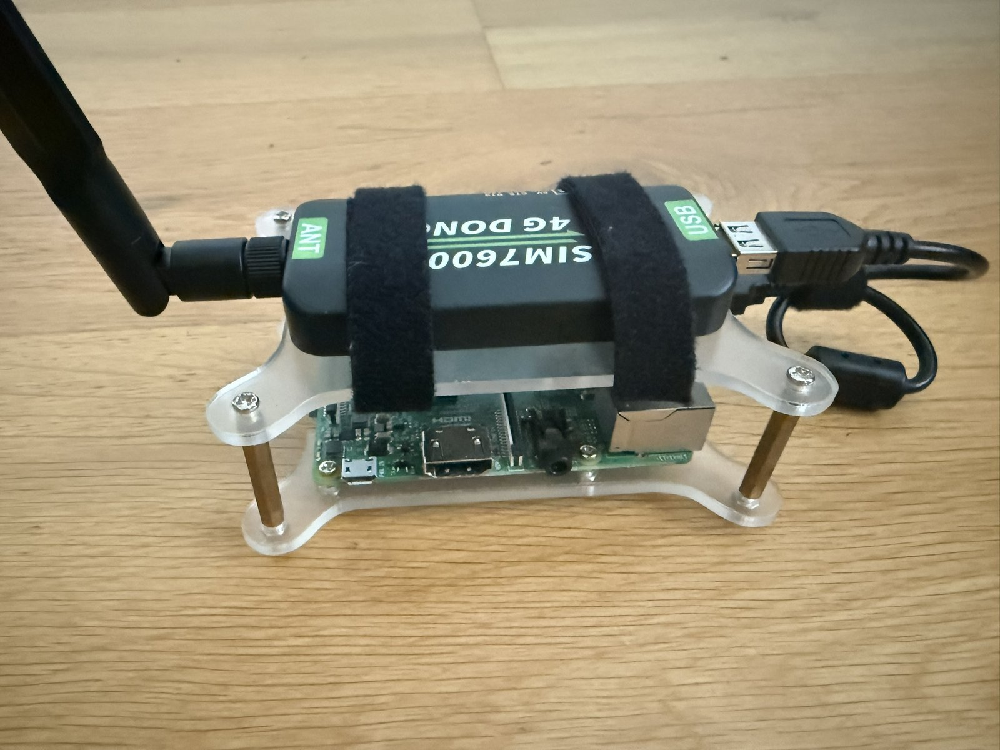

# Hardware

What the gateway runs on, what to buy, and the three details that cause most first-time failures:
picking the wrong serial port on the dongle, letting ModemManager grab it, and underestimating the
power supply.



That is a complete gateway. Everything else in this document is about choosing the two parts in
that photo and getting the host to talk to them.

## Any Linux host will do

The gateway is a USB application, not a Raspberry Pi application. It needs a Linux machine with a
free USB port, Docker, and nothing else. The Pi is the *reference* build because it is the most
constrained target — if the resource budget fits there, it fits anywhere.

| Host | Works | Notes |
|---|---|---|
| Raspberry Pi 3 / 4 / 5 | Yes | The reference build. Pi 3 with 1 GB RAM is the design floor. |
| x86-64 mini PC, thin client | Yes | Usually the best value: faster builds, no SD-card wear, often already on 24/7. |
| NAS (Synology, QNAP, TrueNAS, Unraid) | Yes | Anything that runs Docker and passes a USB serial device through. |
| Old laptop | Yes | Built-in UPS. Disable suspend-on-lid-close. |
| x86 server / homelab host | Yes | Fine, though a whole server for ~6 messages a minute is generous. |
| VM (Proxmox, ESXi, KVM) | Yes | Requires USB passthrough of the dongle to the guest. |
| Router with USB (OpenWrt) | Usually not | Rarely enough storage or RAM for Docker plus this image. |
| Docker Desktop on Windows / macOS | **No** | Neither passes USB serial devices into Linux containers. Use a Linux host or a Linux VM with passthrough. |

Requirements in one line: **any Linux with a 64-bit kernel, Docker, a free USB port, and ~300 MB of
RAM to spare.** The image builds natively for whatever architecture you are on — there is no
cross-compilation step and no separate arm build.

**Architecture note.** `python3-gammu` comes from Debian's repositories, which cover both `arm64`
and `amd64`, so the same `Dockerfile` works on both. 32-bit `armhf` also has the package, but the
project is only tested on 64-bit.

The rest of this page is written with a Pi in mind because that is the fussiest case. On a mini PC
you can skip [Power](#power) entirely and most of [Enclosure and placement](#enclosure-and-placement).

## Bill of materials

| Part | What works | Notes |
|---|---|---|
| Host | See [above](#any-linux-host-will-do) | Anything with Linux, Docker and USB. |
| Modem | **Waveshare SIM7600E-H 4G USB dongle** | The reference device. Other SIM7600 regional variants (`-CE-H`, `-A-H`, `-G-H`) expose the same AT interface and differ only in supported bands — pick the one for your region. |
| SIM card | Any voice/SMS-capable consumer or M2M SIM | **The PIN must be disabled.** The gateway does not enter one. |
| Antennas | The ones shipped with the dongle | Screw both on. The main antenna alone measurably reduces signal quality. |
| USB cable | A decent short one | Only needed if the dongle does not plug in directly. Thin or long cables cause voltage drops. |
| Power supply | Host-appropriate; on a Pi 3 **5 V / 2.5 A** minimum | See [Power](#power). Not negotiable on a Pi. |
| Storage | 16 GB+ microSD, or better a USB SSD | The database stays tiny, but the worker commits a status/heartbeat write every 5 seconds, so the gateway is a constant small writer. Harmless on an SSD; on a microSD card it is a reason to prefer USB storage for a long-lived install. |

Roughly €60–80 for a Pi-based build if you buy everything new, or the price of the dongle alone if
you already have a machine that is on all day.

A Pi Zero 2 W works electrically but is not recommended: building this image on it takes a very
long time.

### Other modems

The driver speaks to the modem through `python-gammu`, so anything Gammu supports over a serial AT
port has a fair chance of working. Only the SIM7600E-H is tested. If you try another device, what
matters is that it exposes a **dedicated AT command port** and supports the standard SMS commands.
Many cheap "4G surf sticks" only expose a network interface and no usable AT port.

## The serial port that matters

This is the single most common setup mistake. When plugged in, the SIM7600E-H does not expose one
device but a whole family:

```
/dev/ttyUSB0    diagnostics
/dev/ttyUSB1    NMEA / GPS
/dev/ttyUSB2    AT command port      ← this is the one
/dev/ttyUSB3    modem / PPP
/dev/ttyUSB4    audio
```

The gateway needs the **AT command port**, which is USB interface 02. Talking to any of the others
gives you a modem that connects but never sends anything.

Worse, those `ttyUSBn` numbers are assigned in enumeration order, so they can shift after a reboot,
a replug, or when another USB serial device is present. Never put a raw `ttyUSB2` in your
configuration. Use the stable by-id path:

```bash
ls -l /dev/serial/by-id/
# usb-SimTech__Incorporated_SimTech__Incorporated_0123456789ABCDEF-if02-port0 -> ../../ttyUSB2
```

The entry containing **`-if02-port0`** is the AT port. That full path goes into
`HOST_MODEM_DEVICE`, and `docker-compose.yml` maps it into the worker container as `/dev/modem`.
The application code only ever knows `/dev/modem`, so nothing in the codebase depends on the host's
device numbering, and moving to different hardware is a one-line change.

If `/dev/serial/by-id/` does not exist on your distribution, `udevadm` gives you the same
information:

```bash
udevadm info -q property -n /dev/ttyUSB2 | grep -E 'ID_USB_INTERFACE_NUM|ID_SERIAL'
# ID_USB_INTERFACE_NUM=02   ← the AT port
```

## ModemManager must be disabled

Most desktop-flavoured distributions ship ModemManager, which grabs any modem it finds and starts
probing it. Two processes on one AT port produce interleaved commands and unexplainable errors.

```bash
sudo systemctl disable --now ModemManager
```

Verify it stays gone across a reboot — `systemctl is-enabled ModemManager` should report `disabled`
or `masked`, or report that the unit does not exist. On minimal server images (Raspberry Pi OS
Lite, Debian netinst, Ubuntu Server) it is usually not installed at all.

If you need ModemManager for another device on the same machine, blacklist just this one instead of
disabling the service:

```
# /etc/udev/rules.d/99-sms-gateway.rules
SUBSYSTEM=="tty", ATTRS{idVendor}=="1e0e", ENV{ID_MM_DEVICE_IGNORE}="1"
```

Then `sudo udevadm control --reload && sudo udevadm trigger`. Confirm the vendor id with `lsusb`.

## Power

Mostly a Raspberry Pi and SBC concern; a mini PC or laptop has margin to spare.

The dongle draws short, sharp current spikes while its transmitter is active. With a marginal
supply or a thin cable the voltage dips, and the symptom is not "no power" but something far more
confusing: the modem works while idle, then resets in the middle of sending, and the worker log
fills with reconnects.

- Use a supply rated **5 V / 2.5 A or more**, ideally the official one for your board (micro-USB on
  a Pi 1–3, USB-C on a Pi 4/5 — same rule either way).
- Avoid long or thin USB extension cables between the host and the dongle.
- Avoid unpowered USB hubs. If you need a hub, use a powered one — this also solves the problem on
  hosts whose ports are current-limited.
- On a Pi, `vcgencmd get_throttled` returning anything other than `throttled=0x0` means the board
  has seen under-voltage.

## SIM card and network

- **Disable the PIN** before inserting the card — for example in a phone, under SIM security.
- The modem registers on the network by itself; there is nothing to configure for SMS. An APN is
  only needed for data, which the gateway does not use.
- Insert the SIM before powering the dongle. It is not hot-swappable in practice.
- **The gateway cannot read its own number reliably.** Most SIMs do not store it. Set it manually in
  the panel under Settings so the dashboard and chat headers can show it; it is display-only.
- A prepaid SIM works, but watch the credit: outbound messages start failing with the modem still
  connected and happy. See [operations.md](operations.md#recurring-situations).

## Delivery reports are firmware-dependent

`status = delivered` requires three things to line up: the gateway must request a status report, the
network must actually send one, and the modem must hand it over.

The SIM7600E-H makes the third part awkward. It does **not** store status reports where they could
be found by polling the message store — it emits them as direct `+CDS` notifications instead. The
driver works around that by registering a gammu incoming callback (`SetIncomingCallback` plus
`SetIncomingSMS(True)`), so reports that do arrive are captured rather than lost. If enabling those
notifications fails, the driver logs it and falls back to storage polling only.

What remains outside the gateway's control is the middle part: many operators and SIM tariffs simply
do not return status reports, and some networks return them hours later. That is why delivery status
is documented as **best effort** throughout: the gateway asks, processes whatever comes back, and
otherwise leaves a successfully submitted message at `sent` forever. A message that never reaches
`delivered` is not a fault — see
[manual/troubleshooting.md](manual/troubleshooting.md#why-messages-never-reach-delivered).

## Verifying the hardware before installing

Worth doing once, before Docker is in the picture, to separate hardware problems from software
problems:

```bash
sudo apt-get install -y gammu

# minimal config pointing at the AT port
printf '[gammu]\nport = /dev/serial/by-id/usb-...-if02-port0\nconnection = at115200\n' > ~/.gammurc

gammu identify        # manufacturer, model, IMEI, firmware
gammu networkinfo     # network name and registration state
gammu getallsms       # reads the SIM/modem message store
```

If `gammu identify` answers and `networkinfo` shows a registered network, the hardware side is done
and you can move on to [installation.md](installation.md). If it does not, no amount of gateway
configuration will help.

Remove `~/.gammurc` afterwards, or at least remember it is there — two things holding the AT port
is exactly the problem this page keeps warning about.

## Enclosure and placement

- Signal quality dominates everything else. A metal enclosure or a basement corner costs more
  messages than any setting in this repository.
- The dongle runs warm during sustained sending; leave it some air. The photo at the top uses an
  open case and velcro for exactly that reason.
- Keep the antenna away from the host board and from mains wiring.
- If the gateway is your alerting path, a small UPS is worth more than any redundancy in software:
  the queue survives power loss, but a powered-off machine sends nothing.
